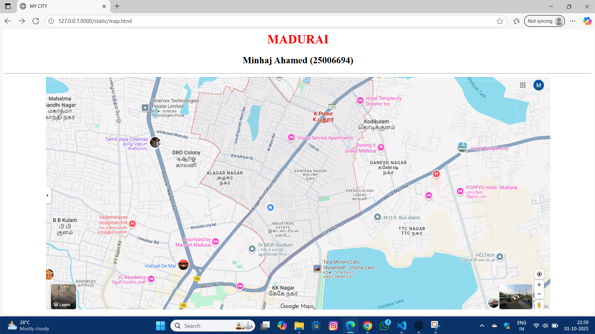
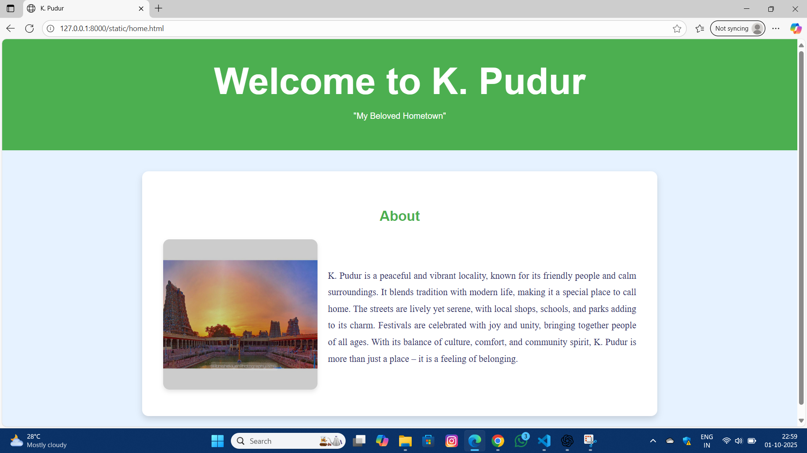
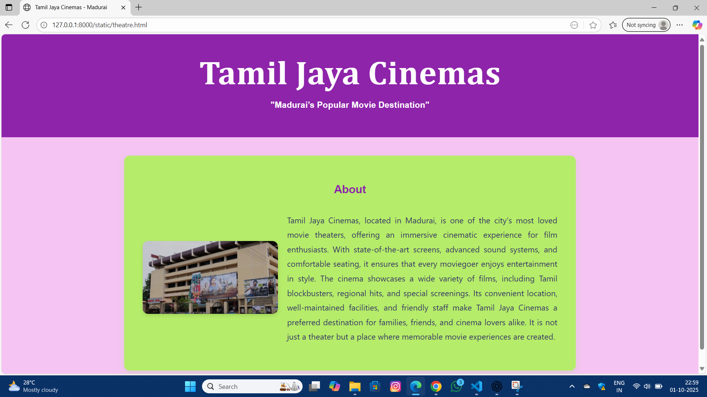
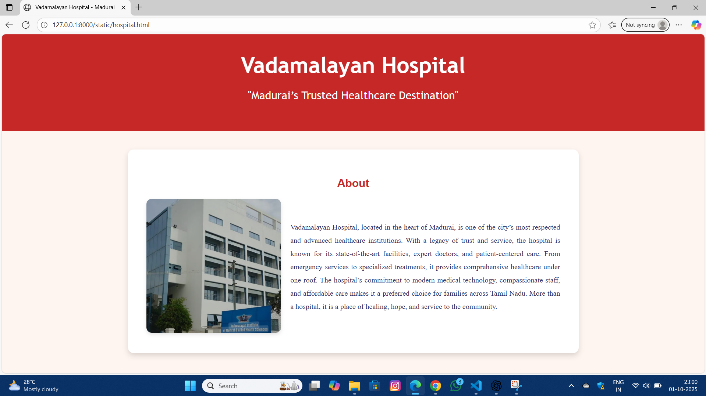
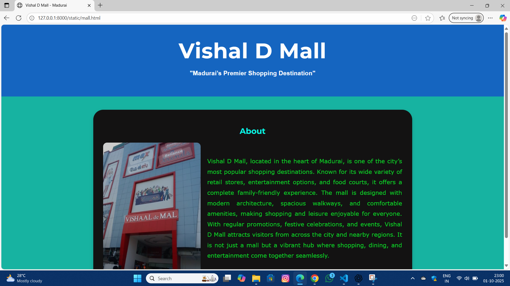
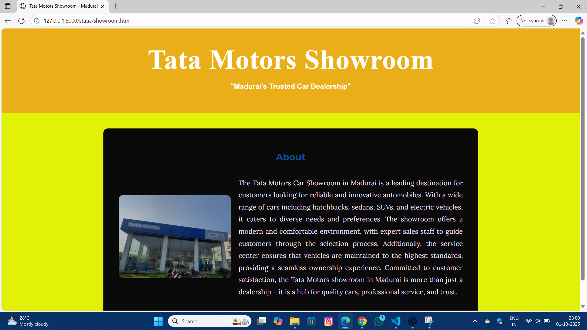

# Ex04 Places Around Me
# Date:01-10-2025
# AIM
To develop a website to display details about the places around my house.

# DESIGN STEPS
## STEP 1
Create a Django admin interface.

## STEP 2
Download your city map from Google.

## STEP 3
Using <map> tag name the map.

## STEP 4
Create clickable regions in the image using <area> tag.

## STEP 5
Write HTML programs for all the regions identified.

## STEP 6
Execute the programs and publish them.

# CODE:
```
map.html

<html>
    <head>
        <title>MY CITY</title> </head>
        <body bgcolor="white">
        <center>
        <h1><font color="red"<b>MADURAI</b></h1></font></h1>
        <h2><font color="black">Minhaj Ahamed (25006694)</font></h2></body><hr>
        
        <map name="MYCITY">
   
        <area shape="circle" coords="720,80,41" title="home" href="home.html">
        <area shape="circle" coords="230,160,70" title="theatre" href="theatre.html">
        <area shape="circle" coords="310,500,62" title="Mall" href="mall.html">
        <area shape="circle" coords="700,500,55" alt="Showroom" href="showroom.html">
        <area shape="circle" coords="190,390,50" title="Hospital" href="hospital.html">    
</map>
   
</html>

home.html

<!DOCTYPE html>
<html lang="en">
<head>
  <meta charset="UTF-8">
  <title>K. Pudur</title>
  <style>
    body {
      font-family: Arial, sans-serif;
      margin: 0;
      background: #e6f2ff;
    }
    header {
      background: #4CAF50;
      color: white;
      text-align: center;
      padding: 40px 10px;
    }
    h1 { margin: 0;
    font-size: 4.4em; }
    section {
      max-width: 900px;
      margin: 40px auto;
      background: white;
      padding: 40px;
      border-radius: 12px;
      box-shadow: 0 6px 12px rgba(0,0,0,0.15);
      text-align: justify;  
      font-size: 1.1rem;
      line-height: 1.8;
    }
    section h2 {
      text-align: center;
      color: #4CAF50;
      margin-bottom: 20px;
    }
    section p {
  color: #e80ec3;             
  font-family: "Georgia", serif; 
  font-size: 1.4rem;        
  line-height: 1.8;          
}

  </style>
</head>
<body>
  <header>
    <h1>Welcome to K. Pudur</h1>
    <p>"My Beloved Hometown"</p>
  </header>

  <section>
  <h2>About</h2>
  <div style="display: flex; flex-wrap: wrap; align-items: center; gap: 20px;">
    <!-- Image -->
    <div style="flex: 1; min-width: 250px;">
      
    </div>
    <!-- Text -->
    <div style="flex: 2; min-width: 300px; text-align: justify; font-family:'Lora', serif; color:#333366; line-height:1.8;">
      K. Pudur is a peaceful and vibrant locality, known for its friendly people and calm surroundings.  
      It blends tradition with modern life, making it a special place to call home.  
      The streets are lively yet serene, with local shops, schools, and parks adding to its charm.  
      Festivals are celebrated with joy and unity, bringing together people of all ages.  
      With its balance of culture, comfort, and community spirit, K. Pudur is more than just a place – it is a feeling of belonging.
    </div>
  </div>
</section>


</body>
</html>

<!DOCTYPE html>
<html lang="en">
<head>
  <meta charset="UTF-8">
  <title>Vadamalayan Hospital - Madurai</title>
  <style>
    body {
      font-family: Arial, sans-serif;
      margin: 0;
      background: #fff5f0; /* light peach background */
    }
    header {
      background: #c62828;  /* dark red for healthcare theme */
      color: white;
      text-align: center;
      padding: 40px 10px;
      font-size: x-large;
     font-family:'Trebuchet MS', 'Lucida Sans Unicode', 'Lucida Grande', 'Lucida Sans', Arial, sans-serif;
    }
    h1 { margin: 0; }
    section {
      max-width: 900px;
      margin: 40px auto;
      background: white;
      padding: 40px;
      border-radius: 12px;
      box-shadow: 0 6px 12px rgba(0,0,0,0.15);
      text-align: justify;
    }
    section h2 {
      text-align: center;
      color: #c62828;
      margin-bottom: 20px;
    }
    section p {
      color: #d409f4; 
      font-family: "Georgia", serif;
      font-size: 1.1rem;
      line-height: 1.8;
    }
  </style>
</head>
<body>
  <header>
    <h1>Vadamalayan Hospital</h1>
    <p>"Madurai’s Trusted Healthcare Destination"</p>
  </header>
<section>
  <h2>About</h2>
  <div style="display: flex; flex-wrap: wrap; align-items: center; gap: 20px;">
    <!-- Image -->
    <div style="flex: 1; min-width: 250px;">
      
    </div>
    <!-- Text -->
    <div style="flex: 2; min-width: 300px; text-align: justify; font-family:'Lora', serif; color:#333366; line-height:1.8;">
      Vadamalayan Hospital, located in the heart of Madurai, is one of the city’s most respected 
      and advanced healthcare institutions. With a legacy of trust and service, the hospital is 
      known for its state-of-the-art facilities, expert doctors, and patient-centered care.  
      From emergency services to specialized treatments, it provides comprehensive healthcare 
      under one roof.  
      The hospital’s commitment to modern medical technology, compassionate staff, and 
      affordable care makes it a preferred choice for families across Tamil Nadu.  
      More than a hospital, it is a place of healing, hope, and service to the community.
    </div>
  </div>
</section>


</body>
</html>

mall.html

<!DOCTYPE html>
<html lang="en">
<head>
  <meta charset="UTF-8">
  <title>Vishal D Mall - Madurai</title>
  <!-- Google Fonts -->
  <link href="https://fonts.googleapis.com/css2?family=Montserrat:wght@700&family=Lora&display=swap" rel="stylesheet">
  <style>
    body {
      font-family: Arial, sans-serif;
      margin: 0;
      background: #17b3a1; /* light blue background */
    }
    header {
      background: #1565c0;  /* deep blue for shopping theme */
      color: white;
      text-align: center;
      padding: 40px 10px;
    }
    h1 {
      margin: 0;
      font-family: 'Montserrat', sans-serif; /* heading font */
      font-size: 4.0rem;
      letter-spacing: 1px;
    }
    section {
      max-width: 900px;
      margin: 40px auto;
      background: rgb(19, 18, 18);
      padding: 30px;
      border-radius: 30px;
      box-shadow: 0 6px 12px rgba(0,0,0,0.15);
      text-align: justify;
    }
    section h2 {
      text-align: center;
      color: #08f1e1;
      margin-bottom: 20px;
      font-family: 'Montserrat', sans-serif;
    }
    section p {
      color: #0bd729; 
      font-family: Verdana, Geneva, Tahoma, sans-serif;
      font-size: 1.1rem;
      line-height: 1.8;
    }
  </style>
</head>
<body>
  <header>
    <h1>Vishal D Mall</h1>
    <h3>"Madurai’s Premier Shopping Destination"</h3>
  </header>
<section>
  <h2>About</h2>
  <div style="display: flex; flex-wrap: wrap; align-items: center; gap: 20px;">
       <div style="flex: 1; min-width: 250px;">
      
    </div>
    
    <div style="flex: 2; min-width: 300px; text-align: justify; font-family:'Lora', serif; color:#333366; line-height:1.8;">
      <p>Vishal D Mall, located in the heart of Madurai, is one of the city’s most popular 
      shopping destinations. Known for its wide variety of retail stores, entertainment options, 
      and food courts, it offers a complete family-friendly experience.  
      The mall is designed with modern architecture, spacious walkways, and comfortable amenities, 
      making shopping and leisure enjoyable for everyone.  
      With regular promotions, festive celebrations, and events, Vishal D Mall attracts visitors from 
      across the city and nearby regions.  
      It is not just a mall but a vibrant hub where shopping, dining, and entertainment come together seamlessly.</p>
    </div>
  </div>
</section>


</body>
</html>

showroom.html

<!DOCTYPE html>
<html lang="en">
<head>
  <meta charset="UTF-8">
  <title>Tata Motors Showroom - Madurai</title>
  <!-- Google Fonts -->
  <link href="https://fonts.googleapis.com/css2?family=Montserrat:wght@700&family=Lora&display=swap" rel="stylesheet">
  <style>
    body {
      font-family: Arial, sans-serif;
      margin: 0;
      background: #e2f207;
    }
    header {
      background: #e9ae18;
      color: white;
      text-align: center;
      padding: 40px 10px;
    }
    h1 {
      margin: 0;
      font-family: 'Times New Roman', Times, serif;
      font-size: 4.5rem;
      letter-spacing: 1px;
    }
    section {
      max-width: 900px;
      margin: 40px auto;
      background: rgb(10, 10, 10);
      padding: 40px;
      border-radius: 12px;
      box-shadow: 0 6px 12px rgba(0,0,0,0.1 5);
      text-align: justify;
    }
    section h2 {
      text-align: center;
      color: #0b4e96;
      margin-bottom: 20px;
      font-family: 'Montserrat', sans-serif;
    }
    section p {
      color: #eadff7; 
      font-family: 'Lora', serif; /* paragraph font */
      font-size: 1.1rem;
      line-height: 1.8;
    }
  </style>
</head>
<body>
  <header>
    <h1>Tata Motors Showroom</h1>
    <h3>"Madurai’s Trusted Car Dealership"</h3>
  </header>

  <section>
  <h2>About</h2>
  <div style="display: flex; flex-wrap: wrap; align-items: center; gap: 20px;">
    <!-- Image -->
    <div style="flex: 1; min-width: 250px;">
      
    </div>
    <!-- Text -->
    <div style="flex: 2; min-width: 300px; text-align: justify; font-family:'Lora', serif; color:#333366; line-height:1.8;">
     <p> The Tata Motors Car Showroom in Madurai is a leading destination for customers looking 
      for reliable and innovative automobiles. With a wide range of cars including hatchbacks, 
      sedans, SUVs, and electric vehicles, it caters to diverse needs and preferences.  
      The showroom offers a modern and comfortable environment, with expert sales staff to 
      guide customers through the selection process.  
      Additionally, the service center ensures that vehicles are maintained to the highest standards, 
      providing a seamless ownership experience.  
      Committed to customer satisfaction, the Tata Motors showroom in Madurai is more than just 
      a dealership – it is a hub for quality cars, professional service, and trust.</p>
    </div>
  </div>
</section>


</body>
</html>

theatre.html

<!DOCTYPE html>
<html lang="en">
<head>
  <meta charset="UTF-8">
  <title>Tamil Jaya Cinemas - Madurai</title>
  <style>
    body {
      font-family: Arial, sans-serif;
      margin: 0;
      background: #f5c4f2; 
    }
    header {
      background: #8e24aa; 
      color: white;
      text-align: center;
      padding: 40px 10px;
    }
    h1 {
      margin: 0;
      font-family: Cambria, Cochin, Georgia, Times, 'Times New Roman', serif;
      font-size: 4.5rem;
      letter-spacing: 1px;
    }
    section {
      max-width: 900px;
      margin: 40px auto;
      background: rgb(181, 236, 105);
      padding: 40px;
      border-radius: 12px;
      box-shadow: 0 6px 12px rgba(52, 243, 5, 0.15);
      text-align: justify;
    }
    section h2 {
      text-align: center;
      color: #8e24aa;
      margin-bottom: 20px;
      font-family: 'Montserrat', sans-serif;
    }
    section p {
      color: #333366; 
      font-family: 'Segoe UI', Tahoma, Geneva, Verdana, sans-serif; 
      font-size: 1.1rem;
      line-height: 1.8;
    }
  </style>
</head>
<body>
  <header>
    <h1>Tamil Jaya Cinemas</h1>
    <h3>"Madurai’s Popular Movie Destination"</h3>
  </header>

  <section>
  <h2>About</h2>
  <div style="display: flex; flex-wrap: wrap; align-items: center; gap: 20px;">
    <!-- Image -->
    <div style="flex: 1; min-width: 250px;">
      
    </div>
    <!-- Text -->
    <div style="flex: 2; min-width: 300px; text-align: justify; font-family:'Lora', serif; color:#333366; line-height:1.8;">
     <p>Tamil Jaya Cinemas, located in Madurai, is one of the city’s most loved movie theaters, 
      offering an immersive cinematic experience for film enthusiasts.  
      With state-of-the-art screens, advanced sound systems, and comfortable seating, it ensures 
      that every moviegoer enjoys entertainment in style.  
      The cinema showcases a wide variety of films, including Tamil blockbusters, regional hits, 
      and special screenings.  
      Its convenient location, well-maintained facilities, and friendly staff make Tamil Jaya Cinemas 
      a preferred destination for families, friends, and cinema lovers alike.  
      It is not just a theater but a place where memorable movie experiences are created.
     </p> </div>
  </div>
</section>


</body>
</html>
```
# OUTPUT:








# RESULT
The program for implementing image maps using HTML is executed successfully.
